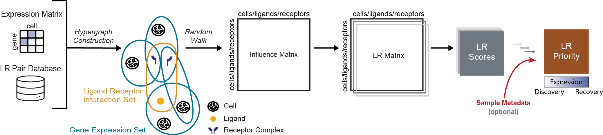

# HyperCom

HyperCom is the R package implementation of the method described in [HyperCom: a hypergraph-based method to infer cell-resolved cell-cell communication](https://www.biorxiv.org/content/10.64898/2026.09.30.755742v1) on biorXiv. It is a hypergraph based method to understand cell-cell communication at a cluster free single-cell resolution.

HyperCom provides the following hypergraph based features described in the <a href="https://raw.githubusercontent.com/pawelab/HyperCom/master/vignettes/articles/HyperCom_Overview.pdf" download>overview vignette</a>:

1. Per Cell Ligand-Receptor Pair Scoring

2. Per Dataset Ligand-Receptor Pair Prioritization

## Installation
```r
devtools::install_github("pawelab/HyperCom")
```

## Method Overview

