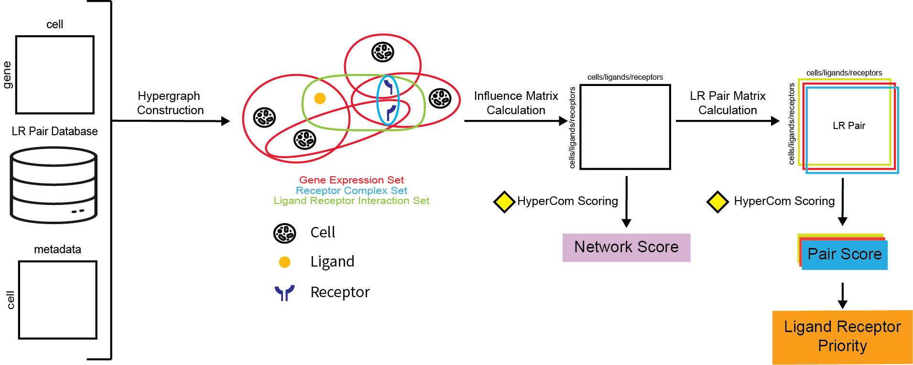

# HyperCom

HyperCom is the R package implementation of the method described in [Moy and Przytycki, 202X](https://doi.org). It is a hypergraph based method to understand cell-cell communication at a cluster free single-cell resolution.

HyperCom provides the following hypergraph based features described in the [overview vignette](vignettes/articles/HyperCom_Overview.pdf):

1. Per Cell Ligand-Receptor Pair Scoring

2. Per Dataset Ligand-Receptor Pair Prioritization

## Installation
```r
devtools::install_github("pawelab/HyperCom")
```

## Method Overview

